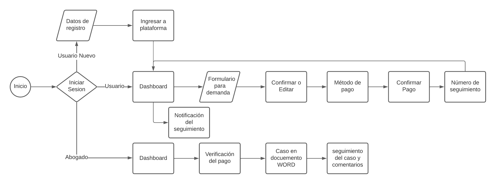
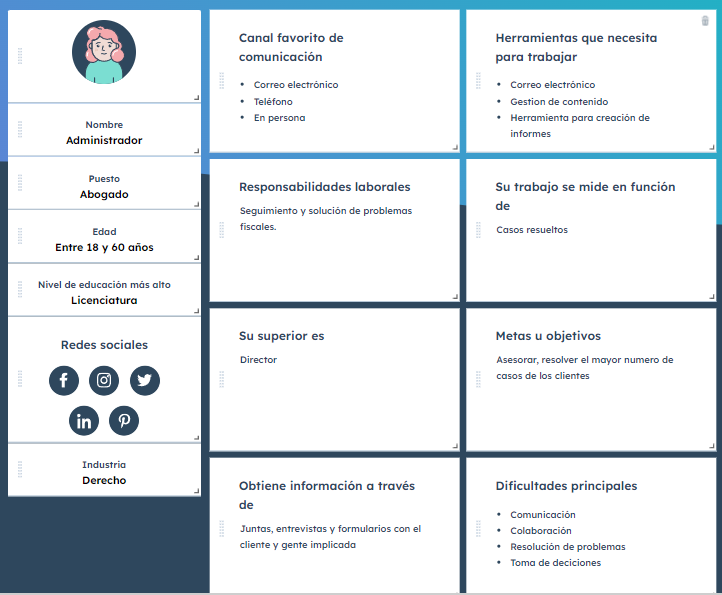

<h1 align="center"> PRACTICA ABOGABOT </h1>

## Descripción

El cliente tiene la posibilidad de hacer una demanda mediante una pagina web la cual ayudara a automatizar las 
demandas, por lo que se pide que el usuario tenga una cuenta en la plataforma, y pueda llenar un formulario para
la demanda y al finalizarlo se debe hacer otro formulario para el proceso del pago y finalizar la transaccion.

Para el abogado debe tener una pagina en la cual vera los casos de los clientes de la plataforma y poder ver
las confirmaciones del pago para agregar comentarios al proceso y al cliente le lleguen correos. 

## **1. Toma de requerimientos**

Los requerimientos que tendra la pagina web para los clientes y abogados son los siguientes:

***Cliente***
- Creación de cuenta cliente
- Llenado de formulario para la demanda
- Método de pago para el seguimiento del caso
- Número en la lista 
- Seguimiento de demanda
- Correos para ver el avance
- Pagina web responsiva para moviles
- Color de pagina azul marino con blanco 

***Abogado***

- Abogado recibe notificación de nueva demanda
- Se crea el documento de acuerdo a los datos del cliente
- Recibe el pago y ve el ingreso recibido
- Actualización de proceso y comentarios en el proceso 
- Número en la lista del cliente
- Seguimiento de demanda
- Correos para ver el avance
- Pagina web responsiva para moviles
- Color de pagina azul marino con blanco 

***Diagrama de flujo***

Se crea el diagrama de flujo con la pagina web [ludid](https://lucid.app)

 

## **2. Buyer Persona**

Se crea el buyer persona con la ayuda de la pagina [hubspot](https://www.hubspot.es/make-my-persona)

## **3. Publico Objetivo**

Para el publico objetivo se define a los posibles clientes del servicio y las necesidades a resolver con ayuda de la pagina [Miro](https://miro.com)

## **4. Primer Wireframe**

